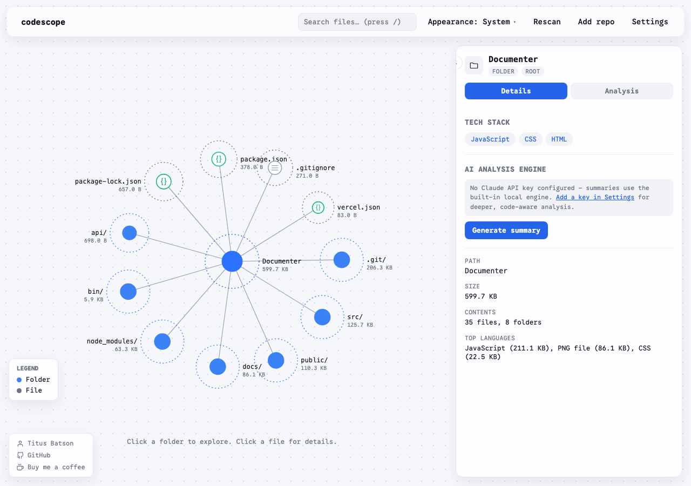
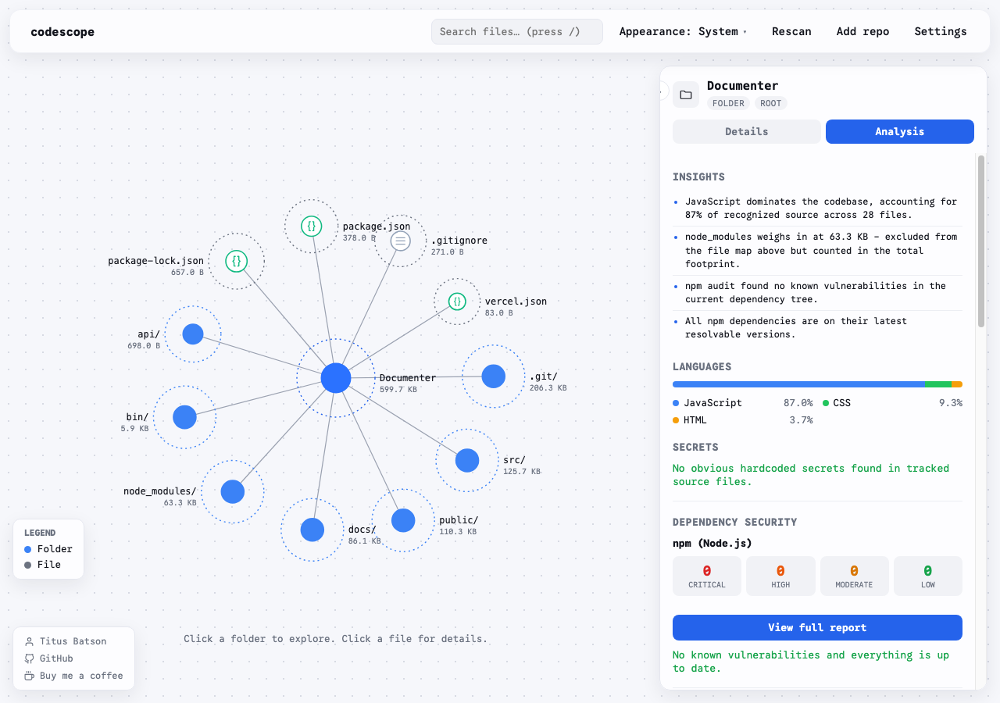
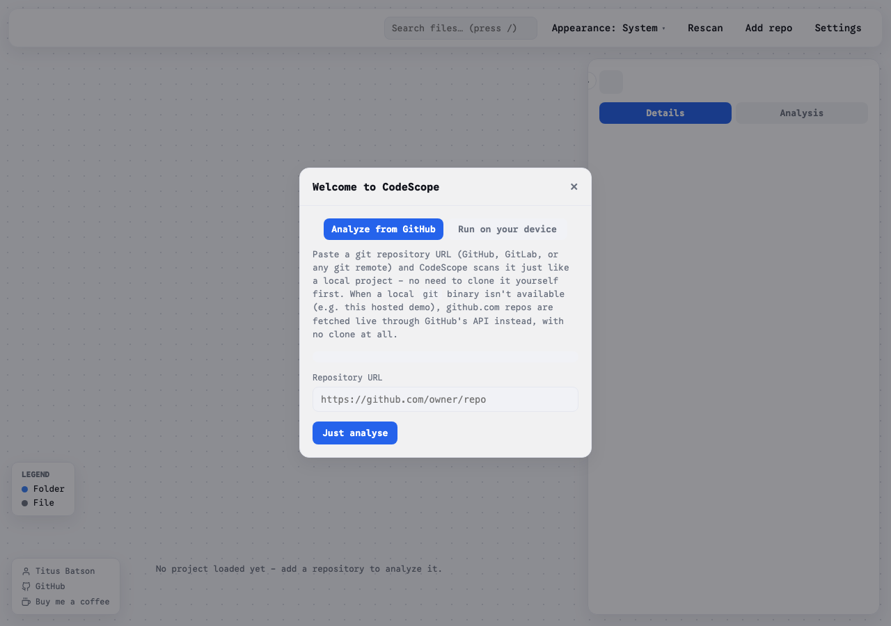

# CodeScope

CodeScope scans a codebase and turns it into an interactive, force-directed graph you can explore, alongside security, quality, and dependency analysis. Run it locally against any project on your machine, or use the hosted version to analyze a public GitHub repo with no install at all.



## Features

- **Interactive graph** of your project's folders and files, sized by disk usage, with pan, zoom, and click-to-drill-down navigation.
- **AI-powered summaries** of files and folders using Claude, with a built-in local fallback engine when no API key is configured.
- **Security scanning**: injection patterns (SQL, command, XSS, template, LDAP/XML), auth and access control issues, insecure crypto, CSRF/CORS/SSRF, hardcoded secrets, and memory/logic issues in C/C++.
- **Dependency auditing** for npm and composer, plus WordPress plugin/theme freshness checks against the live WordPress.org API.
- **Code quality heuristics**: complexity/long-function detection, dead code, duplicate blocks, and test coverage overlays (lcov).
- **Git-aware**: contributor breakdown, hot files/churn, per-file commit history, all pulled from real git history.
- **License compliance** checks and one-click CycloneDX SBOM export.
- **Scan history**: snapshots are saved locally so rescans show trend deltas over time.
- **CI mode**: a headless summary with a configurable failure threshold, for use in build pipelines.
- **Webhook notifications** when a rescan finds new vulnerabilities or secrets.
- **Multi-project mode** with a project switcher, so one running instance can serve several codebases.
- **Add a repo directly**: paste a git URL and CodeScope clones (or, with no local `git` binary, fetches live via GitHub's API) and scans it, no manual clone step required.



## Quickstart

Requires Node.js 18 or later.

```bash
git clone https://github.com/btbatson/codescope.git
cd codescope
npm install
node bin/codescope.js /path/to/your/project
```

This opens a dashboard at `http://localhost:4488` and scans the given project directly from disk. Run `npm install -g .` once and you can use the `codescope` command from any directory instead:

```bash
npm install -g .
codescope /path/to/your/project
```

## Usage

```
codescope [path]                 Launch the interactive dashboard in your browser
codescope [path1] [path2] ...    Launch the dashboard with a project switcher for multiple projects
codescope [path] --out file.html Write a static, shareable HTML report instead
codescope ci [path]              Headless CI check, prints a summary, exits non-zero on findings
```

Options:

| Flag | Description |
| --- | --- |
| `-p, --port <n>` | Dashboard server port (default: 4488) |
| `--no-open` | Don't auto-open the browser |
| `-o, --out <file>` | Write a static HTML report to this path (skips the server) |
| `--json` | With `--out`, also write the raw scan and security data as JSON |
| `--fail-on <level>` | CI mode only: `critical`, `high`, `moderate`, or `low` (default: `high`) |
| `--ignore-secrets` | CI mode only: don't fail the build on found secrets |
| `-h, --help` | Show help |

## Configuring AI summaries

Add an Anthropic API key from the Settings panel in the dashboard, or set the `ANTHROPIC_API_KEY` environment variable before starting CodeScope. The key is stored only on your machine, in `~/.codescope/config.json`, and is used only to call Anthropic's API. Without a key, file and folder summaries fall back to a built-in local engine, no external calls made.

## Hosted / no-install mode



CodeScope can also run as a stateless web app with no local project of its own; visitors add a public GitHub repo URL and it's analyzed on the spot. This is the mode used for the hosted demo, and it's what boots when there's no target directory on startup, such as on Vercel.

In that mode there's no `git` binary or persistent disk to rely on, so "add a repo" fetches the repository's file tree and contents straight from GitHub's REST API and CDN instead of cloning it. This path only supports public github.com repositories.

### Deploying your own copy

1. Fork or clone this repository and push it to your own GitHub account.
2. Import it into Vercel with no build configuration needed.
3. Optionally set `ANTHROPIC_API_KEY` as a Vercel environment variable to enable real Claude-powered summaries in the deployed instance; otherwise it uses the local fallback engine.
4. Optionally set `GITHUB_TOKEN` to raise the GitHub API rate limit used by the no-clone fetch path.

## How data is handled

Nothing you scan leaves your machine unless you explicitly configure an Anthropic API key (for AI summaries) or a webhook URL (for vulnerability notifications). Local scans read files directly from disk; the hosted mode only ever touches the public repository you point it at.

## License

MIT
